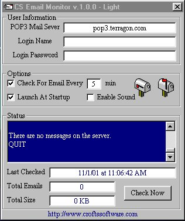



## CS Email Monitor \- Light v\.1\.0

### Description

This will check a pop3 email account for any email. It runs in the systray and all settings can be saved. This is pretty handy at times. See Pic. Not much to this the pro version will have a LOT more options.
 
### More Info
 

             |
---                |---
**Submitted On**   |2001-11-01 11:07:12
**By**             |[Shane Croft](https://github.com/Planet-Source-Code/PSCIndex/blob/master/ByAuthor/shane-croft.md)
**Level**          |Intermediate
**User Rating**    |4.8 (48 globes from 10 users)
**Compatibility**  |VB 6\.0
**Category**       |[Complete Applications](https://github.com/Planet-Source-Code/PSCIndex/blob/master/ByCategory/complete-applications__1-27.md)
**World**          |[Visual Basic](https://github.com/Planet-Source-Code/PSCIndex/blob/master/ByWorld/visual-basic.md)
**Archive File**   |[CS Email M325491112001\.zip](https://github.com/Planet-Source-Code/shane-croft-cs-email-monitor-light-v-1-0__1-28569/archive/master.zip)

